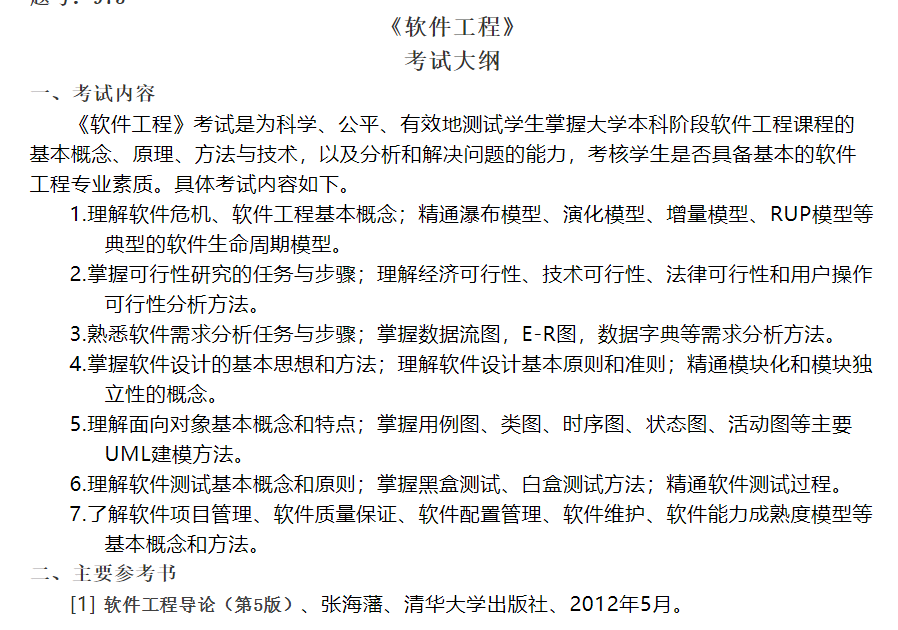

# 概述

## 1.软件危机

软件开发和维护过程中遇到的一系列严重问题，具体表现为

- 成本和进度估计不准
- 用户不满意
- 质量不行
- 不好维护
- 没有文档资料

产生原因：对软件开发和维护认识不全，认为软件开发就是编码，忽视其他阶段

-------

## 2.软件工程概念

指导计算机软件开发和维护的一门工程学科

为了经济地获得可靠的且能在实际机器上有效运行的软件，而建立和使用完善的工程原理

-------

## 3.软件生命周期

- 软件定义
  - 问题定义
  - 可行性研究
  - 需求分析
- 软件开发
  - 系统设计
    - 总体设计
    - 详细设计
  - 系统实现
    - 编码和单元测试
    - 综合测试
- 运行维护

-----

## 4.软件开发模型

- 瀑布模型：具有顺序性
- 快速原型模型
- 增量模型：整个产品分解为多个构建，分批逐步向用户提交产品
- 螺旋模型：在每个阶段前都增加风险分析
- 喷泉模型：面向对象的软件过程模型，各个阶段之间彼此交叠
- RUP模型：二维生命周期模型，9个核心工作流+4个连续阶段，采用迭代式开发
- 敏捷过程：快速响应变化，最重要的是极限编程

# 可行性研究

## 1.任务

用最小的代价在最短时间内确定问题是否值得解决

--------

## 2.步骤

1. 复查系统规模和目标
2. 研究目前正在使用的系统
3. 导出新系统的高层逻辑模型
4. 进一步定义问题
5. 导出和评价供选择的方法
6. 推荐行动方针
7. 草拟开发计划
8. 书写文档提交审查

--------

## 3.可行性分析方法

- 技术可行性：现有技术能否实现这个系统
- 经济可行性：系统的经济效益如何
- 操作可行性：系统的操作方式对用户是否行得通

# 需求分析

## 1.需求分析任务

- 确定综合需求
  - 功能需求
  - 性能需求
  - 可靠性需求
  - 可用性需求
  - 出错处理需求
  - 接口需求
  - 约束
  - 逆向需求
  - 将来可能提出的要求
- 分析数据要求
- 导出系统的逻辑模型
- 修改开发计划

# 总体设计

包括选择方案、功能分解、设计软件结构、设计数据库等

## 1.模块化

把程序划分为可独立命名、可独立访问的模块，每个模块完成一个子功能，将这些模块集成起来可以构成一个整体

-------

## 2.模块独立性

模块独立是模块化、抽象、信息隐藏和局部化的结果，有两个度量标准

### 2.1耦合

不同模块间互连的程序

- 数据耦合：两个模块仅交换数据
- 控制耦合：传递的信息中含控制信息
- 特征耦合：将整个数据结构作为参数进行传递，而实际上只需要使用其中的一部分数据
- 公共环境耦合：多个模块通过一个公共数据环境相互作用
- 内容耦合：

### 2.2内聚

模块内各元素彼此结合的紧密程度

- 低内聚
  - 偶然内聚
  - 逻辑内聚
  - 时间内聚
- 中内聚
  - 过程内聚
  - 通信内聚
- 高内聚
  - 顺序内聚
  - 功能内聚

# 测试

## 1.测试方法

- 黑盒测试：功能测试

  - 等价划分
  - 边界值分析
  - 错误推测

- 白盒测试：结构测试

  - 逻辑覆盖
    - 语句覆盖
    - 判定覆盖
    - 条件覆盖
    - 判定/条件覆盖
    - 条件组合覆盖
    - 点覆盖
    - 边覆盖
    - 路径覆盖

  - 控制结构测试
    - 基本路径测试
    - 条件测试
    - 循环测试

-------

## 2.测试步骤

1. 模块测试/单元测试
2. 子系统测试
3. 系统测试
4. 验收测试
5. 平行运行

# 维护

软件已经交付使用后，为了改正错误或满足新的需要而修改软件的过程

- 改正性维护
- 适应性维护
- 完善性维护
- 预防性维护

# 面向对象

## 1.概念

------

## 2.特点

- 认为世界由各种对象组合在一起
- 所有对象可划分为各种对象类
- 按子类与父类的关系
- 对象之间仅能通过传递消息互相联系

## 3.UML图

- 结构图
  - 类图
  - 对象图
  - 组件图
  - 部署图
  - 包图
- 行为图
  - 用例图
  - 活动图
  - 状态图
  - 交互图
    - 序列图
    - 协作图

# 软件项目管理

## 1.项目管理

## 2.质量保证

- 审查
- 测试
- 程序正确性证明

-------

## 3.配置管理

进行版本控制

- 数据
- 文档
- 程序

--------

## 4.能力成熟度

1. 初始级
2. 可重复级
3. 已定义级
4. 已管理级
5. 优化级